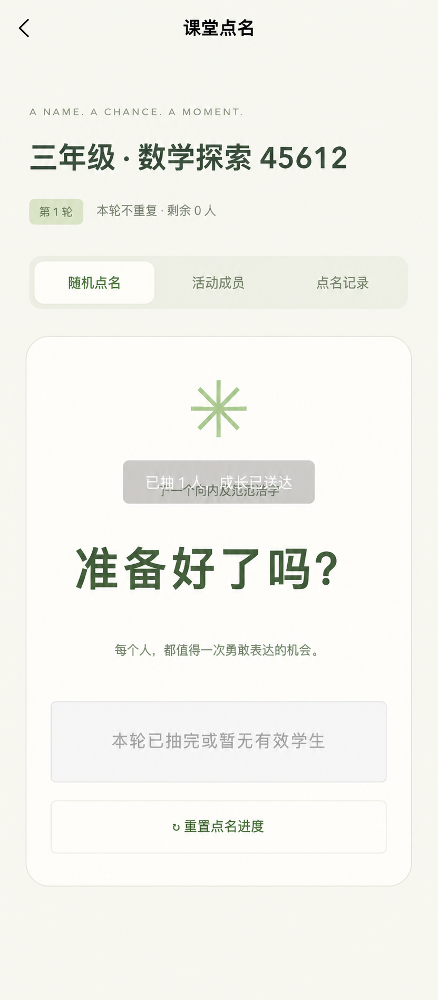
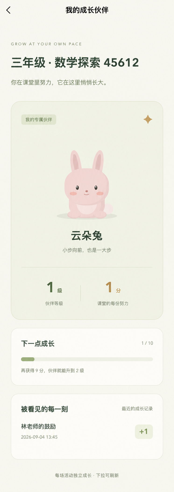
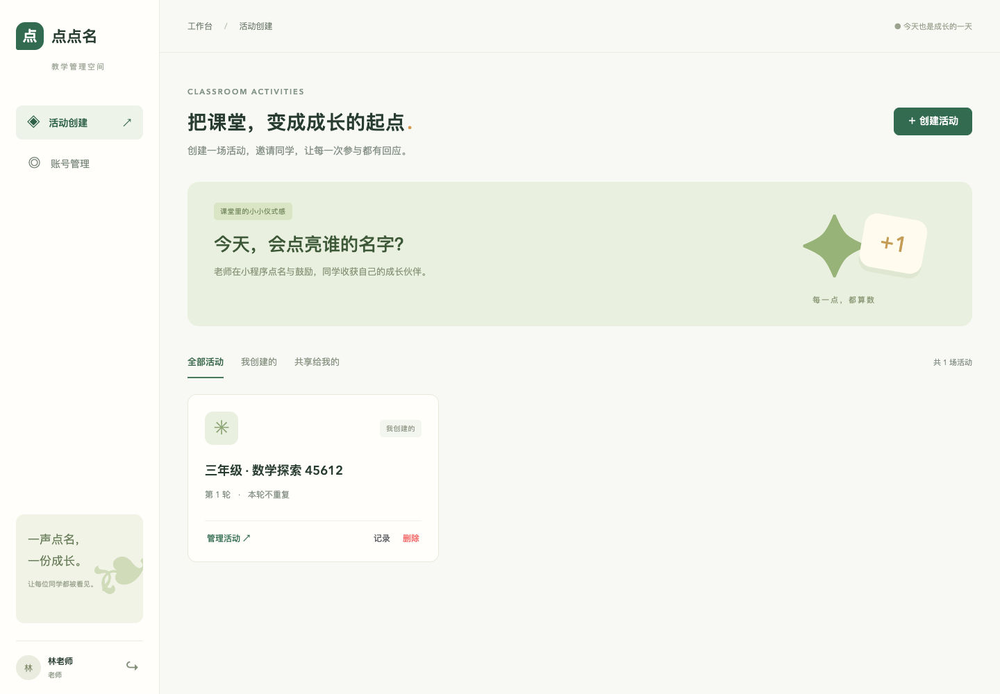
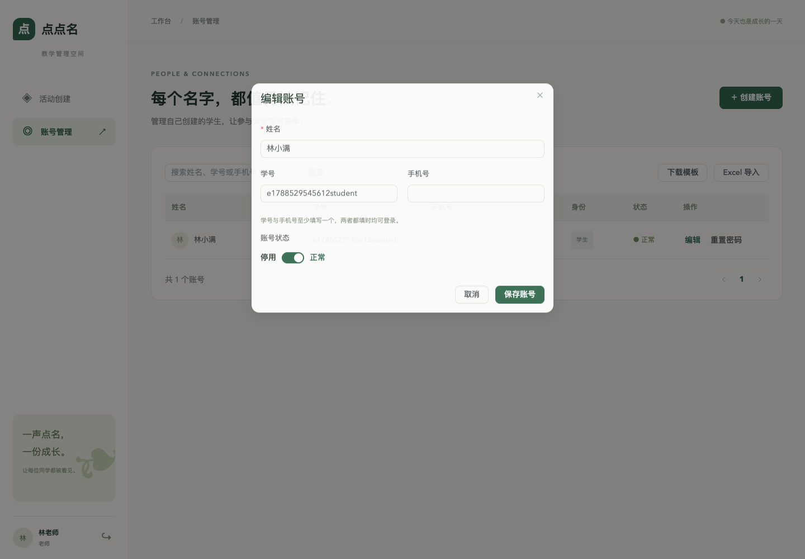
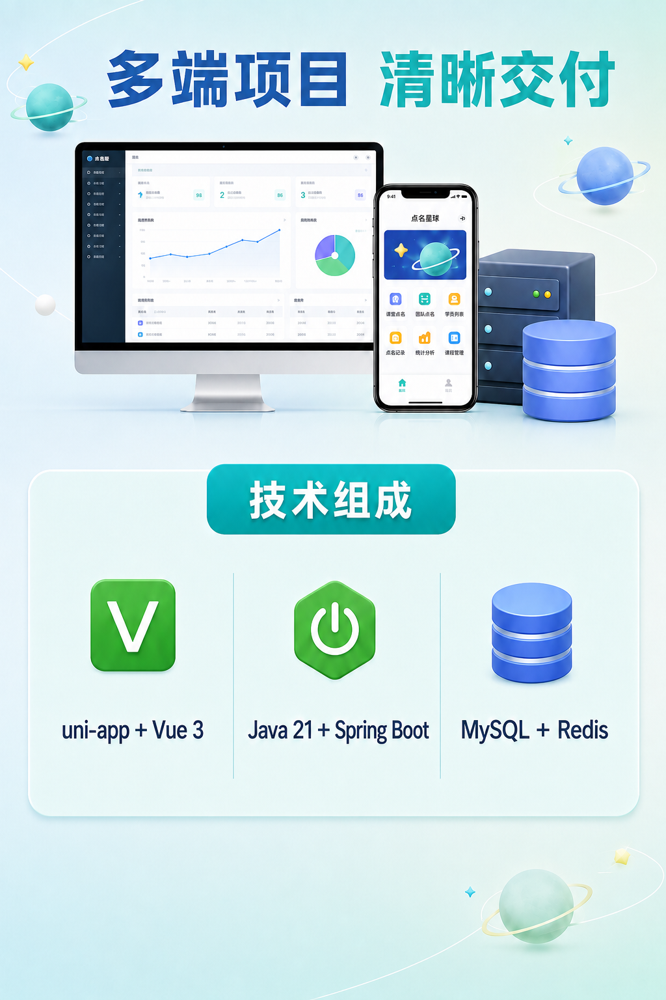

# 点名星球

面向课堂教学的学生随机点名、积分激励与宠物成长系统。

系统包含微信小程序、H5、Vue 管理后台和 Java 接口服务。登录时无需选择身份，服务端会根据账号真实角色自动进入管理员、老师或学生对应界面。


## 项目亮点

- **统一登录入口**：使用学号或手机号登录，根据账号角色自动分流。
- **服务端权限校验**：客户端角色只用于界面展示，所有接口均校验真实身份和资源权限。
- **随机与不重复点名**：支持重复抽取、按轮次不重复抽取和手动重置轮次。
- **多人共享活动**：活动创建者和共享老师共同使用同一成员、轮次及待确认结果。
- **幂等与并发控制**：避免连续点击、网络重试或多人同时操作造成重复抽取和重复加分。
- **课堂积分激励**：点名结果可选择加 1 分或不加分，积分流水与总积分在同一事务内提交。
- **宠物成长反馈**：学生可选择猫、兔或龙，每个活动独立保存积分、等级与宠物。
- **Excel 批量导入**：整批校验、错误预览、确认后写入，校验失败不会产生部分数据。
- **Redis 登录会话**：支持令牌过期、主动退出、账号停用及重置密码后撤销会话。

## 页面预览

### 老师端与学生端

| 老师端点名 | 学生宠物成长 |
| --- | --- |
|  |  |

### 管理后台

| 活动管理 | 账号管理 |
| --- | --- |
|  |  |

## 角色与权限

| 角色 | 使用端 | 主要权限 |
| --- | --- | --- |
| 系统管理员 | 管理后台 | 管理全部账号与活动、创建老师、查看固定角色、维护网站设置 |
| 老师 | 管理后台、小程序、H5 | 管理自己创建的学生和活动，使用共享活动，点名、加分和重置轮次 |
| 学生 | 小程序、H5 | 查看自己加入的活动、积分、等级、宠物及本人加分记录 |

每个账号只有一个固定角色，不支持客户端选择或自定义角色。老师不能创建管理员或其他老师，也不能编辑其他老师名下的学生账号。

## 核心业务

### 账号管理

- 姓名、学号、手机号、角色、归属老师及启用状态。
- 学号和手机号至少填写一个，两个字段均位于全局唯一的登录标识命名空间。
- 学号以字符串保存，可保留前导零。
- 密码使用 BCrypt 哈希存储，支持停用账号和密码重置。
- Excel 仅导入学生，先完成整批校验，再确认写入。

### 活动与共享

- 活动包含名称、学生成员、共享老师和点名模式。
- 创建者与共享老师拥有完整活动操作权限，但共享不会授予其他老师的账号编辑权限。
- 撤销共享后立即取消老师的活动权限，活动中已有学生仍然保留。
- 活动采用逻辑删除，删除后不可继续访问，但历史业务数据保留。

### 点名与积分

- 重复模式从全部有效成员中抽取。
- 不重复模式从当前轮次尚未抽中的有效成员中抽取。
- 同一活动同一时间只允许存在一个待确认结果。
- 结果处理支持“加 1 分”和“不加分”，每条点名记录只能处理一次。
- 重置只开启新的点名轮次，不清空学生积分。

### 宠物成长

- 支持奶糖猫、云朵兔和青芽龙三种宠物。
- 每个“学生＋活动”独立保存宠物、积分和等级。
- 等级计算：`等级 = 1 + floor(积分 / 10)`。
- 1～10 级逐步增大宠物体型，10 级后体型封顶，等级仍可继续提升。
- 学生被移出活动后失去访问权，重新加入同一活动时恢复原成长数据。

## 技术栈

| 模块 | 技术 |
| --- | --- |
| `console` | Vue 3、JavaScript、Vite、Element Plus |
| `web` | uni-app、Vue 3、JavaScript，支持微信小程序和 H5 |
| `server` | Java 21、Spring Boot 3.5、Spring Security、MyBatis-Plus |
| 数据存储 | MySQL、Redis |
| 工程能力 | Maven、Swagger / OpenAPI、Apache POI |

项目不使用 TypeScript、Spring Data JPA 或 Flyway。关系数据库 CRUD 与分页由 MyBatis-Plus 处理，复杂权限查询、统计和行锁使用 Mapper SQL；数据库变更通过编号 SQL 文件手动执行。



## 项目结构

```text
.
├── console/                 Vue 3 管理后台
│   ├── src/
│   ├── tests/               单元测试
│   └── e2e/                 Playwright 端到端测试
├── web/                     uni-app 小程序与 H5
│   ├── src/pages/           登录、活动、老师、学生、关于我们页面
│   ├── src/components/      宠物组件
│   └── tests/               前端逻辑测试
├── server/                  Spring Boot 接口服务
│   ├── src/main/java/       Controller、Service、Mapper、Security
│   ├── src/main/resources/  Spring 配置
│   ├── src/test/            后端测试
│   └── sql/                 初始化与增量 SQL
├── 产品图/                  项目介绍与页面截图
└── README.md
```

## 环境要求

- Node.js 20.19 或更高版本
- npm
- JDK 21
- Maven 3.9 或更高版本
- MySQL 8.x
- Redis 6.x 或更高版本

## 快速开始

### 1. 初始化数据库

在空数据库环境中执行初始化 SQL：

```bash
mysql -h 127.0.0.1 -u root -p < server/sql/001-init.sql
```

初始化脚本仅执行一次。已有数据库升级时，请根据 [SQL 执行说明](server/sql/README.md) 按编号顺序执行增量脚本。

### 2. 启动 Redis

确保 Redis 已启动并允许后端访问。Redis 用于登录会话和登录失败限流，不是业务数据的事实来源；Redis 不可用时系统不会绕过认证。

### 3. 启动后端

建议通过环境变量提供数据库、Redis 和首次管理员配置，不要把真实密码提交到仓库：

先从公开模板创建本机生产配置。生成的 `application-prod.yml` 已被 `.gitignore` 忽略：

```bash
cp server/src/main/resources/application-prod.example.yml \
   server/src/main/resources/application-prod.yml
```

```bash
export SPRING_PROFILES_ACTIVE=prod
export DB_URL='jdbc:mysql://127.0.0.1:3306/dianming?useUnicode=true&characterEncoding=utf8&serverTimezone=Asia/Shanghai'
export DB_USER='your_database_user'
export DB_PASSWORD='your_database_password'
export REDIS_HOST='127.0.0.1'
export REDIS_PORT='6379'
export REDIS_PASSWORD='your_redis_password'
export BOOTSTRAP_LOGIN='your_initial_admin'
export BOOTSTRAP_PASSWORD='replace_with_a_strong_password'

cd server
mvn spring-boot:run
```

后端默认监听 `127.0.0.1:8000`。首次管理员创建成功后，应移除 `BOOTSTRAP_LOGIN` 和 `BOOTSTRAP_PASSWORD`，避免初始化凭据长期保留。

需要在开发环境查看 Swagger 时设置：

```bash
export SWAGGER_ENABLED=true
```

Swagger UI 地址：`http://127.0.0.1:8000/swagger-ui/index.html`。

### 4. 启动管理后台

```bash
cd console
npm ci
npm run dev
```

默认访问地址：`http://127.0.0.1:5173`。

开发环境 API 地址在 `console/.env.development` 中配置：

```env
VITE_API_BASE=http://127.0.0.1:8000/api/v1
```

### 5. 启动 H5

```bash
cd web
npm ci
npm run dev:h5
```

默认访问地址：`http://127.0.0.1:5174`。

### 6. 构建微信小程序

先在 `web/src/manifest.json` 中填写自己的微信小程序 AppID，并配置 API 地址，然后执行：

```bash
cd web
npm run build:mp-weixin
```

使用微信开发者工具导入：

```text
web/dist/build/mp-weixin
```

小程序构建会将帮助截图改为从 `https://dianmingfront.hwaxy.cn/static/help/teacher-classroom.png` 加载，不把 H5 图片打入小程序包；请在微信公众平台将 `dianmingfront.hwaxy.cn` 配置为下载文件合法域名。真机运行还需要可访问的 HTTPS API，并配置 request 合法域名。

## 构建生产版本

```bash
# 管理后台
cd console
npm run build

# H5
cd ../web
npm run build:h5

# 微信小程序
npm run build:mp-weixin

# Java 后端
cd ../server
mvn clean package
```

构建产物：

```text
console/dist/
web/dist/build/h5/
web/dist/build/mp-weixin/
server/target/rollcall-server-1.0.0.jar
```

生产环境建议由 Apache 或 Nginx 将 HTTPS API 域名反向代理到 `127.0.0.1:8000`。Swagger 默认关闭，并应使用专用数据库账号、受保护的 Redis 和强随机密码。

### H5 搜索与 AI 检索优化

执行 `npm run build:h5` 时，会在 `web/dist/build/h5/` 自动生成面向搜索与 AI 检索的公开中文页面：

```text
/teacher/             老师端功能
/student/             学生端功能
/random-roll-call/    随机点名规则
/multi-teacher/       多老师协作
/faq/                 常见问题
/about/               关于我们
/robots.txt           爬虫访问规则
/sitemap.xml          站点地图
/llms.txt              文本辅助摘要
```

这些页面包含独立标题、摘要、canonical、Open Graph 信息、可见中文正文和 JSON-LD 结构化数据。部署 H5 时应上传整个 `web/dist/build/h5/` 目录，并确认服务器能够直接访问上述目录地址，不能把所有路径都重写到业务应用的 `index.html`。

上线后可将 `https://dianmingfront.hwaxy.cn/sitemap.xml` 提交到百度搜索资源平台、神马站长平台、Google Search Console 和 Bing Webmaster Tools。

## 测试与检查

```bash
# 管理后台
cd console
npm test
npm run lint

# 小程序与 H5
cd ../web
npm test
npm run lint

# 后端
cd ../server
mvn test
```

端到端测试位于 `console/e2e`，需要先启动前后端服务，并使用独立测试数据库。不要对生产数据库执行会创建测试数据的端到端测试。

## API 与安全设计

- REST API 统一使用 `/api/v1` 前缀。
- 登录请求只提交登录标识和密码，不接受客户端角色作为身份依据。
- 密码使用 BCrypt 哈希存储，日志不记录密码和登录令牌。
- Redis 保存有期限、可撤销的随机会话令牌。
- 活动行锁和事务串行处理点名、成员变更和轮次重置。
- 点名请求使用幂等标识，加分流水对点名记录唯一。
- MySQL 是业务数据的唯一事实来源。
- 生产环境 CORS 只允许明确配置的前台和后台域名。

## 上传 GitHub 前的安全检查

公开仓库前务必完成以下检查：

1. 删除配置文件中的真实数据库、Redis、管理员密码和令牌。
2. 将敏感配置改为无默认值的环境变量占位符。
3. 不提交 `runtime/`、`target/`、`dist/`、日志、数据库文件和 IDE 私有配置。
4. 检查 Git 历史中是否曾提交过密码；仅删除当前文件中的密码并不能清除历史记录。
5. 对任何已经暴露或提交过的凭据立即执行轮换。
6. 确认生产域名、微信 AppID 和服务器地址是否适合公开展示。

可以在提交前进行一次基础搜索：

```bash
git grep -nEi 'password|secret|token|api[_-]?key|private[_-]?key'
```

## 当前版本边界

- 不提供公开注册、短信登录或微信身份登录。
- 不支持自定义角色、减分或学生自由更换宠物。
- 源码和构建产物不等于微信平台审核通过；发布仍需自己的 AppID、HTTPS 域名及合法域名配置。
- 生产部署、域名、证书和平台审核不属于源码本身。

## 许可证

当前项目尚未附带开源许可证。准备公开发布时，请根据实际授权方式补充 `LICENSE`；在获得明确授权前，不应默认允许复制、修改或商业使用。


## 体验

前台：https://dianmingfront.hwaxy.cn
小程序：

后台：https://dianmingconsole.hwaxy.cn/

有什么需要帮助的可联系

